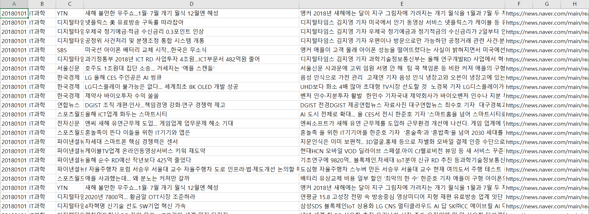
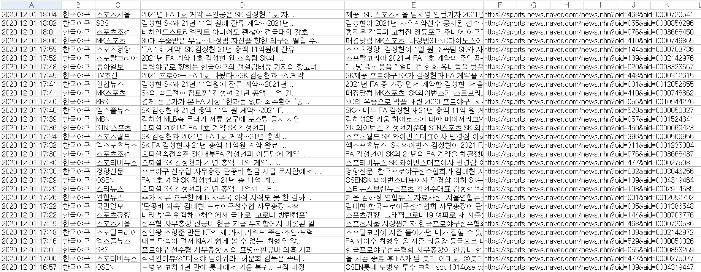

# KoreaNewsCrawler
[](https://opensource.org/licenses/Apache-2.0)

이 크롤러는 네이버 포털에 올라오는 언론사 뉴스 기사들을 크롤링 해주는 크롤러입니다.  
크롤링 가능한 기사 카테고리는 정치, 경제, 생활문화, IT과학, 사회 입니다.  
스포츠 기사같은 경우 야구, 축구, 농구, 배구, 골프, 일반 스포츠, e스포츠 입니다.  

**스포츠 기사는 현재 html 형식이 바껴 사용이 불가능 한 상태입니다. 빠른 시일내로 업데이트 하겠습니다.**

## User Python Installation
  * **BeautifulSoup**
  
    ``` pip install beautifulsoup4 ```
  
  * **requests**
  
    ``` pip install requests ```  
    
 외부 라이브러리 설치가 필요합니다.
## Method

* **set_category(category_name)**
  
 이 메서드는 수집하려고자 하는 카테고리는 설정하는 메서드입니다.  
 파라미터에 들어갈 수 있는 카테고리는 '정치', '경제', '사회', '생활문화', '세계', 'IT과학'입니다.  
 파라미터는 여러 개 들어갈 수 있습니다.  
  
* **set_date_range(startyear, endyear, endmonth)**
  
 이 메서드는 수집하려고자 하는 뉴스의 기간을 의미합니다. 기본적으로 1월달부터 endmonth월까지 데이터를 수집합니다.
  
* **start()**
  
 이 메서드는 크롤링 실행 메서드입니다.
  
## Example
```
from articlecrawler import ArticleCrawler

Crawler = ArticleCrawler()  
Crawler.set_category("정치", "IT과학", "세계", "경제")  
Crawler.set_date_range(2017, 2018, 4)  
Crawler.start()
```
  2017년 1월 ~ 2018년 4월까지 정치, IT과학, 세계, 경제 카테고리 뉴스를 멀티프로세서를 이용하여 병렬 크롤링을 진행합니다.
  
## Multi Thread 안내
  intel i5 9600 cpu로 테스트 해본 결과 1개의 카테고리 당 평균 **8%** 의 cpu 점유율을 보였습니다.  
  크롤러를 실행하는 컴퓨터 사양에 맞게 카테고리 개수를 맞추시거나 반복문을 이용하시기 바랍니다.
  
  
  
## Results
 
 
 
 수집한 모든 데이터는 csv 확장자로 저장됩니다.
 
## License
 Apache License 2.0
 
