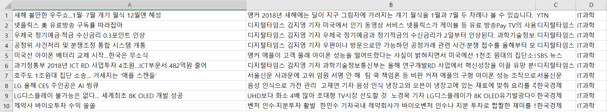

# KoreaNewsCrawler

이 크롤러는 네이버 포털에 올라오는 언론사 뉴스 기사들을 크롤링 해주는 크롤러입니다.  
크롤링 가능한 기사 카테고리는 정치, 경제, 생활문화, IT과학, 사회, 세계, 오피니언입니다.  
스포츠 기사같은 경우 해외야구, 해외축구, 한국야구, 한국축구, 농구, 배구, 골프, 일반 스포츠, e스포츠입니다.  
  
## How to install
    pip install KoreaNewsCrawler
    
## Method

* **set_category(category_name)**
  
 이 메서드는 수집하려고자 하는 카테고리는 설정하는 메서드입니다.  
 파라미터에 들어갈 수 있는 카테고리는 '정치', '경제', '사회', '생활문화', 'IT과학', '세계', '오피니언'입니다.  
 파라미터는 여러 개 들어갈 수 있습니다.  
 category_name: 정치, 경제, 사회, 생활문화, IT과학, 세계, 오피니언 or politics, economy, society, living_culture, IT_science, world, opinion
  
* **set_date_range(startyear, startmonth, endyear, endmonth)**
  
 이 메서드는 수집하려고자 하는 뉴스의 기간을 의미합니다. 기본적으로 startmonth월부터 endmonth월까지 데이터를 수집합니다.
  
* **start()**
  
 이 메서드는 크롤링 실행 메서드입니다.
  
## Article News Crawler Example
```
from korea_news_crawler.articlecrawler import ArticleCrawler

Crawler = ArticleCrawler()  
Crawler.set_category("정치", "IT과학", "economy")  
Crawler.set_date_range(2017, 1, 2018, 4)  
Crawler.start()
```
  2017년 1월 ~ 2018년 4월까지 정치, IT과학, 경제 카테고리 뉴스를 멀티프로세서를 이용하여 병렬 크롤링을 진행합니다.

## Sports News Crawler Example 
  Method는 ArticleCrawler()와 유사합니다.
```
from korea_news_crawler.sportcrawler import SportCrawler 

Spt_crawler = SportCrawler()
Spt_crawler.set_category('한국야구','한국축구')
Spt_crawler.set_date_range(2017,1,2018,4)
Spt_crawler.start()
```
  2017년 1월 ~ 2018년 4월까지 한국야구, 한국축구 뉴스를 멀티프로세서를 이용하여 병렬 크롤링을 진행합니다.
  
## Results
 
 
 
 Colum A: 기사 날짜 & 시간  
 Colum B: 기사 카테고리  
 Colum C: 언론사  
 Colum D: 기사 제목  
 Colum E: 기사 본문  
 Colum F: 기사 주소  
 수집한 모든 데이터는 csv 확장자로 저장됩니다.  


# KoreaNewsCrawler (English version)

This crawler crawles news from portal Naver  
Crawlable article categories include politics, economy, lifeculture, global, IT/science, society.  
In the case of sports articles, that include korea baseball, korea soccer, world baseball, world soccer, basketball, volleyball, golf, general sports, e-sports.  

**In the case of sports articles, you can't use sport article crawler because html form is changed. I will update sport article crawler 
as soon as possible.**

## How to install
    pip install KoreaNewsCrawler
    
## Method

* **set_category(category_name)**
 
 This method is setting categories that you want to crawl.  
 Categories that can be entered into parameters are politics, economy, society, living_culture, IT_science. 
 Multiple parameters can be entered.
  
* **set_date_range(startyear, startmonth, endyear, endmonth)**
  
 This method represents the duration of the news you want to collect.  
 Data is collected from startmonth to endmonth.
  
* **start()**
 
 This method is the crawl execution method.
  
## Article News Crawler Example
```
from korea_news_crawler.articlecrawler import ArticleCrawler

Crawler = ArticleCrawler()  
Crawler.set_category("politics", "IT_science", "economy")  
Crawler.set_date_range(2017, 1, 2018, 4)  
Crawler.start()
```
 From January 2017 to April 2018, Parallel crawls will be conducted using multiprocessors for political, IT science, world, and economic category news.

## Sports News Crawler Example
  Method is similar to ArticleCrawler().
```
from korea_news_crawler.sportcrawler import SportCrawler 

Spt_crawler = SportCrawler()
Spt_crawler.set_category('korea baseball','korea soccer')
Spt_crawler.set_date_range(2017,1,2018,4)
Spt_crawler.start()
```
  From January 2017 to April 2018, Parallel crawls will be conducted using multiprocessors for korea baseball, and korea soccer category news.
  
## Results
 
 
 
 Colum A: Article Date & Time  
 Colum B: Article Category  
 Colum C: Article Press  
 Colum D: Article headline  
 Colum E: Article Content  
 Colum F: Article URL  
 
 All collected data is saved as a csv.
